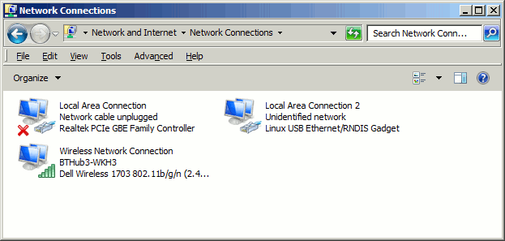
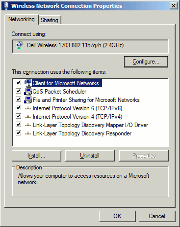
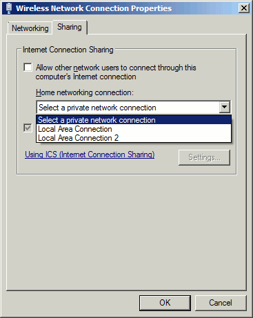
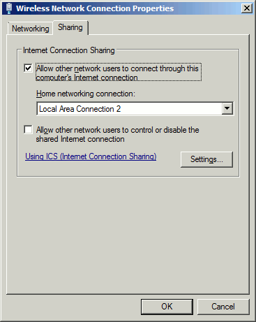

# Flight Software Installation and Setup
This document describes the process of installation of all of the flight software components on a completely fresh 
BeagleBone Black. Some links to other documentation for parts of the installation are provided. This document is still a work in progess.

## Prerequisites
* Clean BeagleBone Black
* SD card (at least 4 GB)
* USB Cable
* Stable internet connection to the bbb (via non UoB computer)
* GitHub API token (online guide: https://docs.github.com/en/authentication/keeping-your-account-and-data-secure/creating-a-personal-access-token)

## 1. OS Flashing
The chosen OS is Debian, with the current testing version of 10.3. The OS should be flashed on the Emmc device onboard 
the BBB from an SD card. For this process a "flasher" OS image should be used, see https://beagleboard.org/latest-images
For detailed steps on how to do this follow this link:
* https://beagleboard.org/getting-started

## 2. Communication with the Board
Communication with the BBB can easily be achieved over SHH via a USB cable. WinSCP (alongside putty) is the best tool to do this
on windows. To establish the connection itself open winSCP and enter the following details:
* Hostname: beaglebone
* Username: debian

Then hit login, yes if any new address query appears and then enter "temppwd" as the password. WinSCP is useful for 
transferring files and providing a graphical insight into the filesystem on the bbb. To actually interact with the bbb 
use putty by clicking on its icon in the top menu bar.

## 3. Required Files from the GitHub

There is only 1 file required: setup.sh

Download the file from the latest master branch. Copy over the file to the Beaglebone using WinSCP. The file must be located at /home/debian/setup.sh.

Run the setup file from /home/debian with the following command:

`$ sh setup.sh`

If any "not found" errors occur, run the following command and re-run the setup afterwards:

`$ sed -i 's/\r$//' setup.sh`

If asked, enter your GitHub username and the personal API token correctly.

The prompt for the internet connection will pop out. Type 'N' if the internet connection with the Beaglebone is not established and continue to the following sections.

## 4. Beaglebone Internet Connection
For future editing, it is useful for the Beaglebone to have an active internet connection. 
This is complicated considerably when an external Anti-Virus is used 
and the way to rectify this is specific to each Anti-Virus. This may involve turning off the firewall.
This method will also not work when a host device is connected to University's network (consider the following method - WiFi dongle).

Access the Windows Control Centre. From here --> Network and Internet -->
Network and Sharing Center --> Change Adapter Settings.



Within this, there will be 2 connections, both for the Beaglebone (External Device/Gadget) and the internet connection
to the host computer.

From the host computer internet, go to 'properties'



then access the 'sharing' tab.


From here, make sure the top box is ticked or a Home networking connection can be set



Then select the adapter associated with the Beaglebone



Move on to the Beaglebone adapter and select the IPv4 properties


For BeagleBone Enhanced:

Change the properties of this, so that the 'Use the following IP address' is checked.

The IP address should be 192.168.7.1

The subnet mask should be 255.255.255.252


For Beaglebone Black:

Change the properties of this, so that the 'Obtain an IP address automatically' is checked.

### 4.1. Alternative Beaglebone Internet Connection
The BeagleBone can also be connected to the internet via the dlink router (acing as an extender for a phone mobile hotspot). 

To set this up for your phone, connect to the router's network named 'dlink-C264-5GHz' and enter the current phone's 
hotspot password. If the router is not currently connected to a phone hotspot the network may appear as 'ESAT-Network' and the password 
should be 'iljjj86635'.

To configure the router, enter 'http://dlinkrouter.local./' in a browser. The page will ask you log in, leave the user as adimin and
enter 'DCWWROWWIFI10010' as the password. Go to wireless setting and ensure the access point mode is set to 
repeater- 2.4Ghz. Turn on your phone's hotspot and scroll down in your browser to site survey and press scan.
Select your phone's hotspot and enter its password. Finally connect the Beagelebone to one of the ethernet ports of the 
router. A basic internet connection should now be established (see next steps for verifacation).

### 4.2. Internet Verification

To verify your internet connection on the Beaglebone, ping google.com with the following command:

`$ ping google.com`

## 5. Setup execution

! Make sure the previous steps were successful, internet connection is required for the following !

Run the setup file again, this time with the internet connection:

`$ sh setup.sh`

The procedure will take some time and will terminate with a reboot of the Beaglebone. Setup is now complete.

## 6. Explanation of Setup 
### 6.1. UART pin and serial console setup
By default the BealgeBone uses UART 0 on the serial debug header as the primary serial console. 
However this has been changed for our purposes, to simplify PCB design to be UART1 that appears on the P9 header.
this has been done, alongside the actual enabling of UARTs 1,2 and 4 by editing the /boot/uEnv.txt file
(or /boot/uboot/uEnv.txt on older beaglebone images). the commands below can be run to check pin modes:
```
cd /opt/scripts/device/bone
sudo ./show-pins.pl
```
The contents of the uEnv.txt file is edited when executing the setup.sh script and should be the following (minus comments):
```buildoutcfg
#Docs: http://elinux.org/Beagleboard:U-boot_partitioning_layout_2.0

uname_r=4.19.94-ti-r42
#uuid=
#dtb=

###U-Boot Overlays###
###Documentation: http://elinux.org/Beagleboard:BeagleBoneBlack_Debian#U-Boot_Overlays
###Master Enable
disable_uboot_overlay_video=1
disable_uboot_overlay_audio=1

enable_uboot_overlays=1
# UART 1
uboot_overlay_addr0=/lib/firmware/BB-UART1-00A0.dtbo
# UART 2
uboot_overlay_addr1=/lib/firmware/BB-UART2-00A0.dtbo
# UART 4
uboot_overlay_addr2=/lib/firmware/BB-UART4-00A0.dtbo
# UART 5
uboot_overlay_addr3=/lib/firmware/BB-UART5-00A0.dtbo
# UART 3 (only TX). Note that in "uboot_overlay_addrX", the X need not be = UART id
uboot_overlay_addr4=/lib/firmware/BB-UART3-00A0.dtbo

###
###Overide capes with eeprom
#uboot_overlay_addr0=/lib/firmware/<file0>.dtbo
#uboot_overlay_addr1=/lib/firmware/<file1>.dtbo
#uboot_overlay_addr2=/lib/firmware/<file2>.dtbo
#uboot_overlay_addr3=/lib/firmware/<file3>.dtbo
###
###Additional custom capes
#uboot_overlay_addr4=/lib/firmware/<file4>.dtbo
#uboot_overlay_addr5=/lib/firmware/<file5>.dtbo
#uboot_overlay_addr6=/lib/firmware/<file6>.dtbo
#uboot_overlay_addr7=/lib/firmware/<file7>.dtbo
###
###Custom Cape
#dtb_overlay=/lib/firmware/<file8>.dtbo
###
###Disable auto loading of virtual capes (emmc/video/wireless/adc)
#disable_uboot_overlay_emmc=1
#disable_uboot_overlay_video=1
#disable_uboot_overlay_audio=1
#disable_uboot_overlay_wireless=1
#disable_uboot_overlay_adc=1
###
###PRUSS OPTIONS
###pru_rproc (4.14.x-ti kernel)
#uboot_overlay_pru=/lib/firmware/AM335X-PRU-RPROC-4-14-TI-00A0.dtbo
###pru_rproc (4.19.x-ti kernel)
uboot_overlay_pru=/lib/firmware/AM335X-PRU-RPROC-4-19-TI-00A0.dtbo
###pru_uio (4.14.x-ti, 4.19.x-ti & mainline/bone kernel)
#uboot_overlay_pru=/lib/firmware/AM335X-PRU-UIO-00A0.dtbo
###
###Cape Universal Enable
enable_uboot_cape_universal=1
###
###Debug: disable uboot autoload of Cape
#disable_uboot_overlay_addr0=1
#disable_uboot_overlay_addr1=1
#disable_uboot_overlay_addr2=1
#disable_uboot_overlay_addr3=1
###
###U-Boot fdt tweaks... (60000 = 384KB)
#uboot_fdt_buffer=0x60000
###U-Boot Overlays###

cmdline=coherent_pool=1M net.ifnames=0 lpj=1990656 rng_core.default_quality=100 quiet

#In the event of edid real failures, uncomment this next line:
#cmdline=coherent_pool=1M net.ifnames=0 lpj=1990656 rng_core.default_quality=100 quiet video=HDMI-A-1:1024x768@60e

##enable Generic eMMC Flasher:
##make sure, these tools are installed: dosfstools rsync
#cmdline=init=/opt/scripts/tools/eMMC/init-eMMC-flasher-v3.sh

#cape_disable=capemgr.disable_partno=BB-BONELT-HDMI,BB-BONELT-HDMIN
cape_enable=capemgr.enable_partno=BB-UART1,BB-UART2,BB-UART4,BB-UART5
optargs= console=ttyS1,115200
```