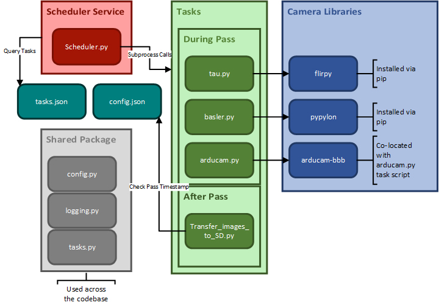

# Software Overview And Architecture
This document describes the main components of PROVE Pathfinder's flight software and how they work together. It firstly
 describes the hardware platform, OS and library dependencies then the custom python code written for the mission.

## BeagleBone Black And Debian OS
The BeagleBone Black is a single board computer, running an Arm Cortex-A8 CPU and 4GB emmc memory. An SD card and as yet
 unselected "reliable" redundant memory device will be used as mass storage for images and log files.
Debian Linux has been selected as the systems OS, as this has wide support, specifically with the BeagleBone Black, and 
a large range of easily accessible packages. The operating system is flashed onto the onboard emmc storage device on 
the BeagleBone Black

## Libraries
The major libraries used by the flight software, besides several general python libraries, are the three camera 
libraries, used when communicating with the camera hardware. The three libraries are:
* flirpy: used to communicate with the Tau II thermal infrared camera
* pypylon: used to communicate with the Basler high resolution camera
* arducam-bbb: used to communicate with the wide field of view ArduCam

## Custom Python Services And Applications
In order to achieve the mission a set of services and applications have been written in python. These allow the system to 
follow the mission timeline and perform functions. The primary components of this layer are:
* Scheduler Service: handles timing control and executes tasks according to mission logic
* Bus Service: handles communication with the spacecraft bus
* Task Applications: The various tasks to be performed by the software, for example taking Tau II images
* Shared Package: Provides the rest of the codebase with common functions and classes

### Overview Diagram
The figure below shows roughly how the python components link with each other (Bus service not yet implemented)


### Repository File Tree
The file structure of the repo and how it should be deployed on the BeagleBone is described below:
```
│   requirements.txt
│
├───docs
│       beaglebone-black.dtb
│       beaglebone_black.dts
│       conf.py
│       Makefile
│       SoftwareoverviewV1_postKubos.png
│       Software_Overview.md
│
└───PROVE-Pathfinder *** THIS DIRECTORY IS DEPLOYED ON THE BEAGLEBONE***
    ├───Scheduler
    │       config.json
    │       scheduler.py
    │       tasks.json
    │
    ├───shared
    │       config.py
    │       logging.py
    │       tasks.py
    │       __init__.py
    │
    ├───Tasks
    │   ├───arducam
    │   │   │   arducam.py
    │   │   │
    │   │   ├───libs
    │   │       │   system_memory.c
    │   │       │
    │   │       └───arducam-bbb
    │   │
    │   ├───basler
    │   │       basler.py
    │   │
    │   ├───tau2
    │   │       tau.py
    │   │
    │   └───Transfer-to-storage
    │           transfer_images_SD.py
    │
    └───tests
            context.py
            test_arducam.py
            test_basler.py
            test_general.py
            test_tau2.py
            __init__.py

```
TODO: add installation process
